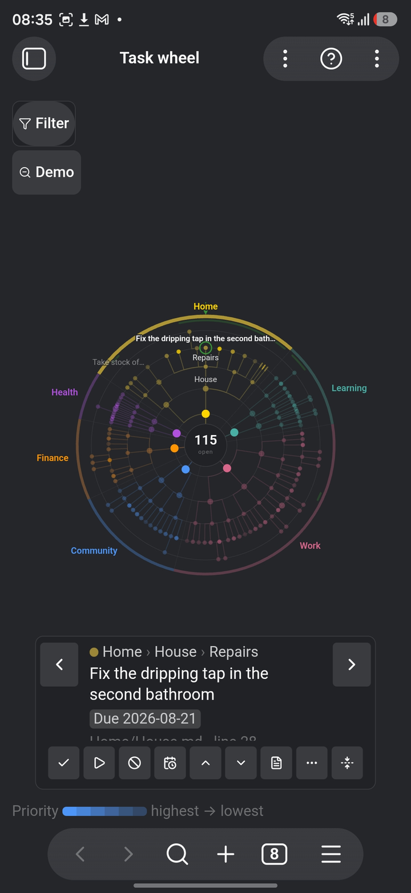
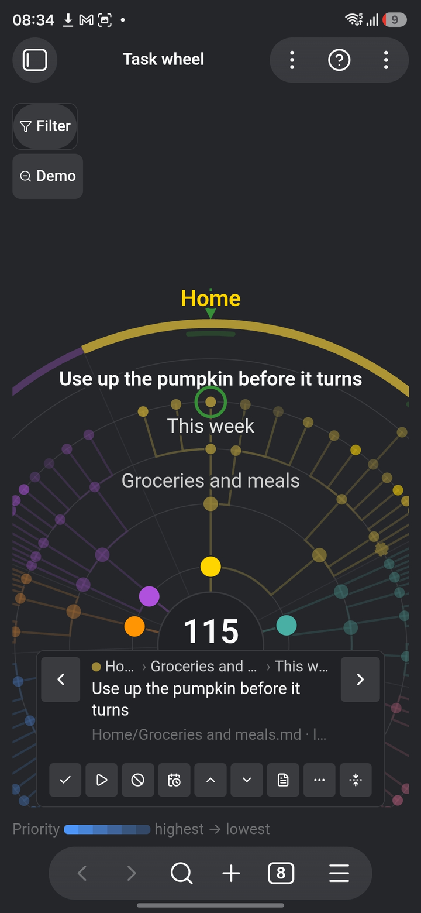
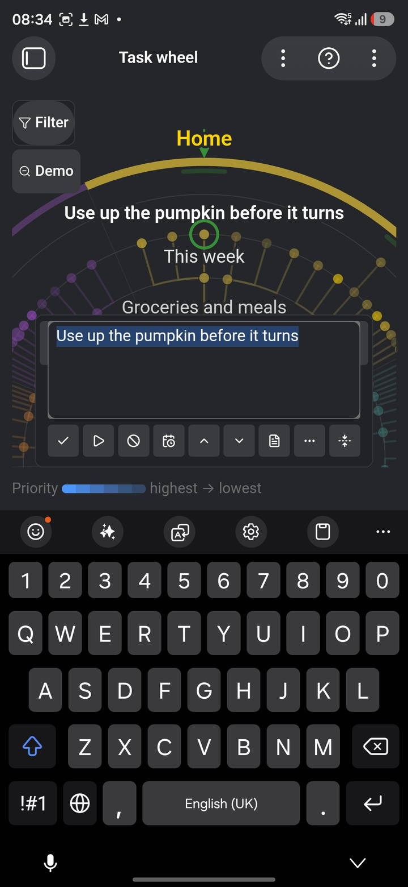
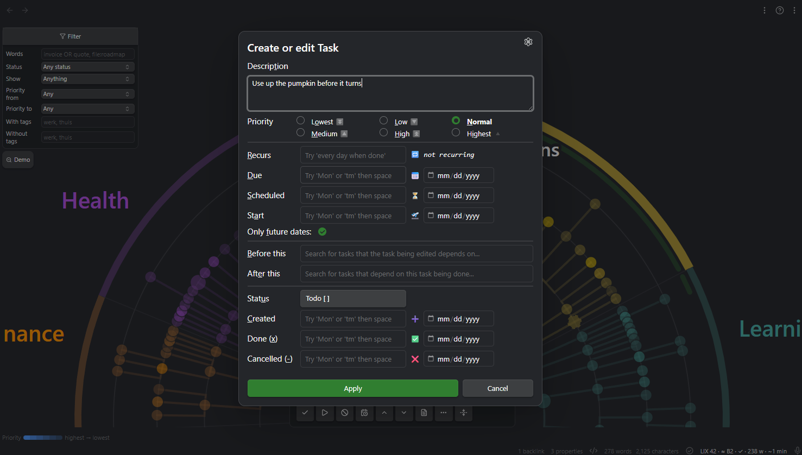

# Task Wheel

*See every open task once — and know that you did.*

Task Wheel is a visual overview of every open task you have: a turnable radial
tree you review one stop at a time. The **angle** is the life domain a task
belongs to; the **radius** is how deep it sits in the hierarchy. You turn the
wheel, and each task comes past a fixed reading wedge at the top, one stop at a
time, until you have been all the way round.

It is a **review instrument, not an execution instrument**. The point is being
able to say with certainty that you have seen everything. Ticking a task off is
possible, but it is not what the wheel is for.

Everything is computed locally: **no network calls, no telemetry, no account**.
Free and GPL-3.0.

| | | |
|---|---|---|
|  |  |  |
| The whole vault at once | The reading wedge, closer in | Editing without leaving the round |

## Why a wheel

A list of five thousand tasks is not reviewable. You scroll, you lose your
place, and you never know whether you reached the end. A circle has no end to
lose: it has a position you can come back to, and a stop for every item.

Two properties make that work, and both are enforced rather than hoped for:

- **Position is stable.** Every domain gets a fixed angular budget that does not
  move with the number of tasks in it. Work grows into its own wedge; empty
  space is allowed to stay empty. That is what lets spatial memory build up —
  "the client work lives at two o'clock" — which is half the value of the idea.
- **Nothing disappears silently.** A folded branch stays as a stump with a
  counter. What the rings cannot reach is counted where it belongs. When a
  filter is on, the wheel says so and says how much it is leaving out. The
  wheel may show you less than everything; it may never be quiet about it.

## What it reads

Plain checkboxes in [Obsidian Tasks](https://publish.obsidian.md/tasks/) syntax.
There is no format of our own to learn:

```markdown
- [ ] Call the plumber 📅 2026-08-20 ⏫ #huis
    - [/] Find the last invoice
- [ ] Water the plants 🔁 every 3 days
- [-] Move the shed
```

All four of Tasks' statuses are read. `[ ]` open and `[/]` **in progress** are
work: both are on the wheel, and started work wears a ring around its dot so
you can see at a glance what you already picked up. `[x]` done and `[-]`
**cancelled** are finished — one you did, one you decided not to do, and
neither leaves anything to review — so both stay off unless you ask for
finished work. A custom status of your own counts as open: an unfamiliar
character is no reason to drop work from a round.

Hierarchy is read in this order of precedence: indentation under a parent task,
then headings in the note, then the note as a project, then the folder as a
domain. The domain can also come from a tag namespace such as `#domein/werk` —
that is a setting.

The Tasks plugin is not required. When it *is* installed, the wheel borrows two
things from it: ticking a task off goes through it, so recurring tasks roll over
exactly as Tasks itself would do it, and the ⋯ menu offers **Edit in Tasks…**,
which opens that plugin's own edit window on the task in front of you —
dates, recurrence, dependencies, your own status set. A setting can send the
quicker gesture there too: *Clicking a task's title* opens the wheel's own box
by default, or that window instead. Without Tasks the entry is simply not there
and the setting has nothing to switch to, so the wheel keeps to what it has:
rewrite the words, change the priority, push a week out, or open the note.



## Working the wheel

| | |
|---|---|
| **Turn** | Drag, scroll, or ← → |
| **One item sideways** | The ‹ › buttons beside the card, or ← → |
| **…the other way of stepping sideways** | Shift + ← → |
| **In or out a ring** | ↑ ↓ |
| **Go to an item** | Tap or click it |
| **Open what you are on** | Double-click or double-tap it, or Enter |
| **Back out to the wider wheel** | Backspace, or the button in the corner — you land back on what you stepped out of |
| **Open the note it lives in** | Ctrl/Cmd + Enter — add Shift if something else on your setup already claims that combination — or the note button on the card |
| **Zoom** | Pinch, ctrl-scroll, or + − |
| **Fold a branch away** | Space, or the button on the card |
| **One stop in the flat order** | PageUp / PageDown |
| **Jump to the first or last** | Home / End |
| **Carry to a named place** | The ⋯ button, or a key you bind yourself |
| **Make it a subtask of another** | The ⋯ button, in a wheel over one note |
| **Help** | The ? in the wheel's header — keys, the drawing's legend, and where this round stands |

The help speaks thirteen languages (English, Nederlands, Deutsch, Français,
Español, Italiano, Português, Русский, 日本語, 한국어, 中文, العربية, हिन्दी) and
follows Obsidian's own language setting; a setting overrides it.

Turning is the big movement; the two chevrons beside the card are the small
one. They do what ← → do — sideways along the ring you are reading — so the
place your eye is on stays put. Turning is where the guarantee lives: it walks
the flat order, and that is the walk that cannot skip anything.

**What sideways steps through is yours to choose**, under *What the arrows step
through*:

- **Every task** (the default) — the next task, wherever it hangs. No branch is
  a dead end.
- **Along the ring** — the next item at the same depth, across branches. Keeps
  the eye at one radius, which is the move for comparing the same level of two
  projects. Be aware that a depth only one branch reaches is a ring of that
  branch alone: a long branch ending in three tasks walks round those three.

On a keyboard the other one is always on **Shift + ← →**, so you never have to
visit the settings to borrow it. The two buttons beside the card follow the
setting on a desktop; **on a phone they always walk every task**, because there
the coarse movement is a finger on the disc and there is no Shift to borrow the
other with.

Either way the step is taken from the **whole** wheel, not from the part of it
that happens to be drawn — deep in a tree the wheel draws your own branch
further out than the rest, and the next item is often one that has yet to be
drawn. It gets drawn, and so does the way to it: a branch you had folded away
opens while you are inside it and closes again when you leave, so looking is
never undoing. So the step never leaves you stuck, it never changes which ring
you are on, and the opposite key always brings you back where you came from.

The wheel always comes to rest on a stop — momentum is allowed, free spinning
is not. That is what makes "I have been all the way round" a fact rather than
a feeling.

It keeps up with the vault on its own. Edit a note in the editor, or let sync
land one, and the wheel re-reads once the vault goes quiet — only for notes it
is actually about, and only while you are looking at it; a wheel in a
background tab catches up when you come back to it. There is no refresh button,
because a round that is only complete if you remembered to press something is
not a round the instrument can promise. *Rescan the vault* is still there as a
command for when you want to force it.

The **reading card** floats over the wheel and holds the item under the wedge:
where it sits, what it says, its dates and priority, and the review actions —
tick off, mark in progress, cancel, push a week out, raise or lower priority,
and open the note. The two status buttons are toggles: pressing the one a task
already carries puts it back to open, which is the only way back from a mis-tap
on a phone. The card keeps one fixed size at every stop, so the drawing
underneath never jumps.

A task like `Finish the training plan [[week-01]]` says half of what it is about
in the link, so the card shows it as one: `[[note]]`, `[[note|alias]]`,
`[label](target)` and a pasted `https://…` are all followed, through Obsidian's
own link resolution from the note the task lives in — ctrl- or cmd-click opens
it beside, as anywhere else. The card is not a renderer, though: embeds
(`![[…]]`) stay as they were written, and nothing else is formatted.

## At scale

A vault of two hundred tasks and one of twenty thousand produce the same amount
of drawing. The wheel never draws more than a fixed number of items; a degree
of interest picks *which* ones — what is under the reading wedge swells and
shows its deeper rings, the far side recedes to a silhouette — and everything
else folds into stumps that carry counters. Turn towards a stump and it opens.

That is the answer to "there is too much to draw". The answer to "there is too
much to review" is the **filter**, in its own panel at the top left of the
wheel: by words, by status, by date, by priority, by tag. A round is then
explicitly a round of that selection, and the panel says which selection and
how much is outside it — even when it is closed.

**Each wheel filters for itself.** Open the vault in one tab and a project in
the next and they no longer take each other's filter over: the filter belongs to
what the wheel is looking at, beside the round it defines. Two wheels over the
*same* thing do share one — they are two windows on one round.

**Status** is *not started*, *in progress* or *finished* — done and cancelled
together, since a round makes no distinction between them. Picking *finished*
brings finished work back for that round whatever *Include finished tasks*
says: asking for it in the filter is asking for it. The hub then counts what it
is showing rather than what is open, and says `shown` instead of `open`.

There is no "deferred" among the statuses, because Tasks has no status
character for it: putting something off is a *date*. So that lives with the
dates, as **parked for later** — a start (🛫) or scheduled (⏳) date that has
not arrived yet, wherever the due date happens to sit — and **ready now**,
which is the same line drawn from the other side: it hides everything you have
already decided not to think about yet. Neither looks at the due date, which is
a deadline and not a deferral. In a vault that uses no 🛫 or ⏳ dates there is
nothing to park, so *ready now* keeps everything and the badge says `0 out` —
that is the filter reporting an empty rule, not ignoring you.

The search box takes four things and nothing more. Words are combined:
`roof invoice` wants both, in any order, and either may be typed slightly
wrong — `plummer` still finds the plumber. `OR` in capitals offers an
alternative: `invoice OR quote`. Quotes hold a phrase together and are matched
exactly: `"annual plan 2027"`. And `file:` looks at the note instead of the
task: `file:roadmap` finds the tasks in every note whose name says so, and
`call file:roadmap` wants both at once. Half of what a task is about is often
only in the title above it — `call` under *Northwind roadmap* never says
Northwind itself — but that is a thing you ask for, so a bare `plan` cannot
quietly drag in everything living in *Plan.md*.

A `*` means here what it means in the settings: any run of characters. A bare
word already matches part of a word, so the star earns its keep in the middle —
`week*report`. A box holding nothing but a star asks for everything, which is
what an empty box already does, so the filter stays off. Inside quotes a star is
an ordinary character, which is how you search for a literal one.

`file:` reads the note's name, not the folders on the way to it, and never its
contents; Obsidian's own search is the tool for that.

## Not every checkbox is a task

A list of acceptance criteria in a story file is a checklist belonging to a
document, not work on your plate — but in *form* it is identical to a task,
because the difference is intent. So the wheel does not guess. It is told, using
structure your vault already carries:

- **Skip notes of these types** — matched against the note's own front-matter
  `type`. A vault that keeps a document standard already says which notes are
  stories, templates or review forms. One entry covers the whole class,
  including every such note you write from now on.
- **Skip checkboxes under these headings** — for a note that holds both. A real
  task under *Goal* still counts while the list under *Acceptance criteria* does
  not, nested items included.

Both take a `*` where you mean "and everything like it": `accepta*` covers
*Acceptatiecriteria* and *Acceptance criteria*, `*criteria` covers anything
ending that way, `*tip*` anything containing it. Without a star the whole name
has to match, because a boundary that widens quietly is worse than one that
makes you type the word out.

Both lists start empty, so nothing disappears until you say so. They are a
boundary like an excluded folder rather than a filter: what falls outside was
never part of a round, so it is not counted as left out either.

Which makes them silent, and a silent rule is one you cannot debug — a pattern
that matches nothing looks exactly like one that works. So there is a command,
*Show what the skip rules take out*: it says per line how many checkboxes that
line removes, names a few of the headings it hit, and marks the ones that take
out nothing. Under it, the headings still in play with their counts, biggest
first. A heading you expected to have caught, sitting in that list, is a
heading spelled differently than you think — or a checklist that turns out to
sit under no heading at all, which no heading rule can reach.

## Two ways to open it

- **The whole vault** — the ribbon icon, or the command *Open the wheel*.
- **One folder or one note** — right-click it in the file list (long-press on a
  phone) and choose *Open task wheel here*.

A local wheel re-roots the angular axis: inside a folder the **subfolders**
become the wedges, inside a note its **headings** do. The angle is always the
top division of what you are looking at. Each wheel keeps its own position,
zoom and folds.

### Editing, but only in a note's own wheel

Over a whole vault the wheel reviews and does not edit. Over one note it *is*
that note's outline — headings are the wedges, indentation is the depth — so
one line is drawn instead: **structure in the wheel, prose in the note.**

- **Move** a task up or down among its siblings, carrying everything underneath
  it, including plain prose lines. `Alt` with an arrow, or the `⋯` button. This
  is the one the wheel does better than the editor. Dragging is deliberately not
  offered: it fights with turning, and on a phone it is fiddly.
- **Move it to another heading** — a different operation from the one above,
  not an extension of it: the task loses its parent, so it lands at the end of
  the section you send it to, at that section's own level. A subtask becomes a
  plain task there, and keeps its own subtasks. You pick the heading by typing
  a couple of letters. In a note's wheel the headings *are* the wedges, so this
  visibly moves the task to a different one. Type a name that is not there yet
  and the last row of the list offers to **make** it — the way Obsidian offers
  to make a folder you move a note into. It becomes a sibling of the section
  the task is in now, right after it, and the row says which level it will get
  before you choose. A name with a **slash** is a path: `org/afdeling 2` makes
  *afdeling 2* under *org*, the way a folder path does. Blank lines around it
  follow the note's own habit: a tightly written note stays tight.
- **Add** a task below this one, or under it. You are asked for the words first,
  so changing your mind leaves no empty checkbox behind.
- **Rename** by clicking the title on the card — the single exception to
  "prose in the note", because a typo is too small a thing to open a tab for. It
  edits the words as written, tags included; the dates, priority and recurrence
  keep their place.

Renaming and moving change what the wheel calls an item — identity is built
from its place and its text — so the round's seen-marks and the reading wedge
are carried across to whatever the items became. An edit never quietly undoes
part of a round.

A **heading** has the same four moves, one level up: move it among its
siblings, hang it under another heading, add a task to it, or give it a
subheading. That includes the note's top headings, which are the wedges here —
so in a note's wheel the wedges sit in the note's own order rather than
alphabetically, and moving one is something you can see. A section travels with everything under it and is renumbered as it
goes — a `###` with two `####` becomes a `##` with two `###`, so the shape
survives and only the depth changes.

Opening the note reuses its tab if it is already open, rather than stacking a
new one every time; and coming back to the wheel lands on the item your cursor
was left on.

There is no delete: cancelling (`[-]`) already says "not doing this" and can be
undone. And the first task in an empty note still has to be typed in the note —
these actions hang off a task, so an empty note has nothing to hang them on.

## Carrying work into another note

The other half of the same idea, and the one that works in **both** wheels. A
task on your active list that turns out to be a someday belongs in the someday
note; a task you come across while reviewing the whole vault belongs on your
list. Both live at the bottom of the `⋯` menu:

- **Copy to another note…** leaves the original exactly where it is. This is
  the one you want most of the time — a task you come across is usually inside
  a document that was explaining something, and taking it out breaks that.
- **Move to another note…** takes it out once it has landed on the other side.

What makes this more than cut and paste is that **the category travels with
it**. A wedge is a heading path, so a task that sat under `Werk › Klanten` lands
under `Werk › Klanten` over there — whatever of that path the other note lacks
is written, whatever it has is used, and nothing is ever duplicated. Two
headings of the same name under different parents are told apart, because the
path is compared from the top.

You are asked two things: **which note**, then **where in it** — and the second
comes with the answer already filled in as the first row, so `Enter` keeps the
path it has. Below that are the other note's own headings, and typing something
else reads as a whole path from the top (`Werk/Klanten`).

One action carries a task with its subtasks, or a whole heading with everything
under it, subheadings included — those are renumbered as a block, so a `###`
with two `####` becomes a `##` with two `###`. A heading left empty in the
source note stays: it may carry prose or meaning the wheel never sees.

**A filter narrows what a branch carries.** Filter on *finished*, stand on a
heading and move it, and the finished work goes to the archive while the open
work stays — the branch carries what the round is showing, not every line under
it. The heading itself stays too, since it still holds what was left out, and
each task keeps the subsection it hung under, so a branch with subsections
arrives as a branch with subsections. Two rules keep it from orphaning
anything: a task that travels takes its whole block, subtasks and all, in the
round or not; and a task that stays keeps everything under it, including a
subtask that *is* in the round. The notice afterwards says how many items went,
and how many stayed behind with the task they sit under. A single task is
unaffected — it always travels whole.

That second rule bites on a shape you will meet often — a card with a finished
checklist under an open task:

```markdown
## Huis en Tuin
- [ ] Balkon opruimen
    - [x] Bezem kopen
    - [x] Stoffer kopen
```

Filter on *finished*, take that branch, and nothing can leave: both items of the
round sit under a task that is staying. The wheel says exactly that, and names
the two ways out — carry that task itself, or turn the filter off. It is a
different message from "nothing here is in this round", which is what an empty
branch gets.

The other note is always written **first**, and the source is only emptied once
the work has landed there. If something goes wrong in between you have it
twice, which you can see and fix, rather than nowhere — and the wheel says so in
those words, rather than leaving you to find the second copy later.

If this note changes while you are choosing where to send the work — a sync
lands, or you edit it in another tab — the carry refuses and tells you the other
note was left alone. Nothing is written anywhere. Try again and it will pick up
what is there now.

New notes are not made from here: a note has a name, a folder and often a
template behind it, and none of those decisions belong on a review card.

## The round

Coming to rest on an item is having reviewed it — there is no second confirming
tap. A faint band inside the rim shows which part of the circle this round has
already passed. The round is about **everything in the vault this wheel is
looking at**, not about what happens to be drawn: the wheel never draws more
than a few hundred items and the rest sit behind stumps, so counting only the
drawn ones would call a round finished long before it was. When the circle
closes, the wheel says so once and starts a new round. *How far is this round?*
and *Start a new round* are commands.

**Changing the filter starts a new round**, and the wheel says so. That is not
an extra rule but the same one: a round is a round *of that selection*, so a
different selection is a different round.

## Not this

Task Wheel deliberately does not do: external task services, a task syntax of
its own, time blocking or calendar integration, multi-user collaboration, or a
full task editor. Splitting a task, rewriting it, or writing a new one belongs
in the note — which is what *open the note* is for.

## Settings worth knowing

- **Domain comes from** — the top folder, a tag namespace, or a front-matter
  property such as `area:`. This decides the angle, so it is the setting with
  the most visible consequence. Only the tag namespace works per *task*, so it
  is the one that lets a single note feed several wedges.
- **Detail** — how many items may be drawn at once (compact 120, balanced 240,
  dense 400).
- **Folders to read / Excluded folders** — in a large vault, naming the four
  folders that hold your tasks beats naming the ninety that do not.
- **Filter** — date, priority and tags. Always visible when it is on.

## Install

**From the community list**: Settings → Community plugins → Browse → search for
*Task Wheel* → Install, then Enable.

**Manually, today**: download `main.js`, `manifest.json` and `styles.css` from
the [latest release](https://github.com/maxonamission/obsidian-task-wheel/releases/latest),
put them in `<vault>/.obsidian/plugins/task-wheel/`, and enable the plugin
under Settings → Community plugins. Or point
[BRAT](https://github.com/TfTHacker/obsidian42-brat) at
`maxonamission/obsidian-task-wheel`.

## Privacy — what leaves your machine

Nothing. The wheel reads your vault through Obsidian's own APIs and writes
back to your notes when you ask it to. There are no network calls, no
telemetry, and no account. Every release asset carries a build-provenance
attestation proving it was built from this repository's source.

## Support

Task Wheel is free. If it changed how you review your work, you can
[buy me a coffee](https://buymeacoffee.com/maxonamission). Bugs and ideas:
[open an issue](https://github.com/maxonamission/obsidian-task-wheel/issues).

## Development

This repository is a source mirror of the working repo; development happens
there and releases are synced here, where `main.js` is built from this source
during the release (that is what the attestation attests).

```bash
npm install
npm test          # vitest
npm run lint      # eslint
npm run build     # tsc --noEmit + esbuild production
```

The layers are kept apart on purpose: `model/`, `parse/` and `layout/` never
import from `obsidian` — an eslint rule enforces it — so every angle, radius,
colour, stop and filter rule is tested headlessly, without an Obsidian window.
`vault/` and `view/` hold everything that talks to the app.

## License

[GPL-3.0](LICENSE).
